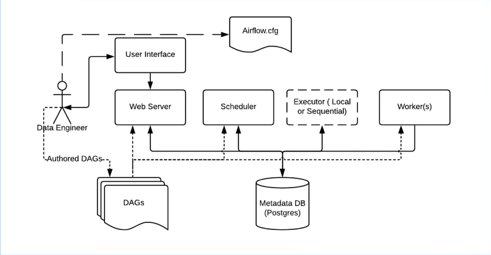
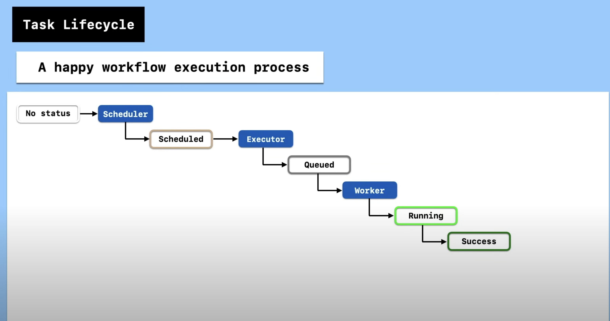
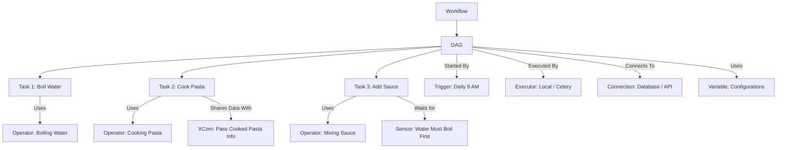

### What the hack is Airflow
Apache Airflow is a tool for automating, scheduling, and monitoring workflows (tasks). Think of it as a smart assistant that helps you run complex data processing jobs in a structured way.

Imagine you have a series of tasks you need to run in a specific order, like:
1️⃣ Extracting data from a database (MySQL, PostgreSQL)
2️⃣ Transforming the data (cleaning, filtering, aggregating)
3️⃣ Loading the data into another system (MongoDB, BigQuery, or a report/dashboard)

Instead of doing this manually every day, Airflow automates it with DAGs.

---

## 📌 Airflow Jargons (From Top to Bottom)  

| **Concept**    | **What It Does**                         | **Example (Analogy)** |
|---------------|--------------------------------|--------------------------------|
| **Workflow**  | The full end-to-end process      | Cooking a meal (ordering, preparing, cooking, serving) 🍽️ |
| **DAG**       | Defines the sequence of tasks    | A **recipe** for making pasta 📖 |
| **Task**      | A single step in the workflow   | **Boiling water** for pasta |
| **Operator**  | Defines how a task is executed  | Using a **stove** to boil water 🔥 |
| **Sensor**    | Waits for a condition before proceeding | **Waits** for water to boil before adding pasta ⏳ |
| **Trigger**   | Starts a DAG                    | **Starts cooking** when an order is placed 🛎️ |
| **Executor**  | Runs the tasks                  | The **chef** who cooks the food 👨‍🍳 |
| **Connection**| Connects to external systems    | **Talking to a supplier** to order more ingredients 📞 |
| **Variable**  | Stores reusable configuration values | Recipe **ingredients list** (e.g., "Use 2 cups of water") 📋 |
| **XCom**      | Shares data between tasks (max 48kb data we can pass through xcom)       | **Passing a note** in the kitchen (e.g., "Pasta is ready for sauce")  📩 |

---




## 📌 How Airflow Works (Simple Diagram)



### ✅ What is a DAG in Airflow?
A DAG (Directed Acyclic Graph) in Apache Airflow is like a to-do list for your tasks, but with a clear order.

👉 Think of it as a recipe:
1️⃣ Prepare ingredients (Task 1)
2️⃣ Cook the meal
3️⃣ Serve the dish

Each step must be done in order (you can't eat before cooking!). Also, there are no loops—once you move forward, you can't go back (that’s why it's called Acyclic).

So, a DAG is just a way to define and schedule tasks in a logical order. 

- Each task is a unit of work, like extracting data, processing it, and storing results.
- Tasks depend on each other and follow a sequence (e.g., Task A → Task B → Task C).


### What is an Executor in Apache Airflow?
An executor in Airflow is like a worker that runs the tasks in a DAG.

💡 Example:
Imagine you have a task list (like making a meal):
1️⃣ Boil water
2️⃣ Cook noodles
3️⃣ Add seasoning
4️⃣ Serve the food
Now, someone needs to actually do the tasks. That "someone" is the executor—it takes each step and runs it.

1) Sequential Executor (Default) – Runs tasks one after another.
2) LocalExecutor – Runs tasks in parallel using multiple workers.
3) Celery Executor – Distributes tasks across multiple machines using Celery + Redis.
4) Kubernetes Executor – Runs tasks in Docker containers dynamically on Kubernetes.

### Commands
```
airflow db init
airflow scheduler
airflow webserver -p 8080
airflow users create --username admin --firstname {x} --lastname {y} --role Admin --email xy@gmail.com
```

### Docker Airflow setup doc
https://airflow.apache.org/docs/apache-airflow/2.1.1/start/docker.html